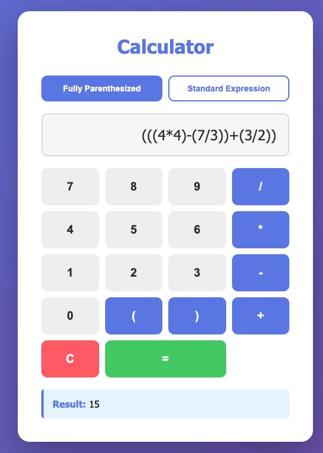

# Homework Assignment 3 (due Oct 6th 11:59pm)

In this assignment, we will explore the implementation of 
stacks, as well as their application in evaluating arithmetic expressions.
We will focus on using stacks to evaluate fully parenthesized
arithmetic expressions, transforming infix expressions to postfix
notation, and evaluating expressions in postfix notation. 
The assignment is worth a total of 100 points.  If 
you have any questions or need assistance, please don't 
hesitate to reach out to us during office hours or post your questions 
on the `Ed Discussion` forum.

## Preliminaries

You can choose any operating system and development environment you 
prefer, such as `Linux`, `MacOS`, or `Windows`.  However, it is 
**strongly recommended** that you have access to a `bash` terminal 
to interact with the compiler and other tools. Regardless of your 
choice, your code must compile and run
correctly using the `g++` compiler from the command line.

## Code structure

You are being provided with the following file structure. Ensure
you maintain this structure while working on the assignment. 

```
src/
  ├── stack.h
  ├── stack.cpp
  ├── eval.cpp
  ├── doctest.h
  ├── calculator.cpp
  ├── test_stack.cpp
  ├── test_fpie.cpp
  └── test_standard.cpp
web/
  ├── server.py
  ├── styles.css
  ├── script.js
  └── index.html
```

## Task 1: The Stack class (30 points)

In this task, the goal is to develop a class `Stack` to represent 
a stack data structure using arrays. The internal array should 
be fixed-length and dynamically allocated.

You should implement the methods shown in the class definition 
below (`stack.h`), along with any other private
methods you deem necessary.  Ensure you do not 
modify the signatures of the methods
provided.  Following standard C++ practices, the header file should be
protected against multiple inclusions via the use of `#pragma once`.
The implementation of all class methods should be in a separate file
named `stack.cpp`.  You should not put any implementation in the header
file `stack.h`.

```cpp
#pragma once
#include <cstddef>

class Stack {
    private:
        int* data;       // pointer to the array storing stack elements
        size_t capacity; // maximum capacity of the stack
        size_t n_elem;   // current number of elements in the stack

    public:
        Stack(size_t cap); // constructor with capacity
        ~Stack();          // destructor to free allocated memory          

        void push(int val);  // push an element onto the stack
        void pop();          // pop the top element from the stack
        int top() const;     // get the top element of the stack
        bool empty() const;  // check if the stack is empty
        size_t size() const; // get the current size of the stack
};
```

The following rules should be followed:

- This task must be completed without using any C++ Standard Library (STL) containers, such as `std::vector` or `std::stack`
- If the constructor is called with a capacity of zero, it should throw an `std::invalid_argument("Capacity must be greater than zero")` exception
- The `push` method should throw an `std::length_error("Exceeds stack capacity")` exception if the stack is full
- The `pop` and `top` methods should throw an `std::out_of_range("Empty stack")` exception if the stack is empty

To work on this task, you may develop your own test program. We are 
providing a sample `test_stack.cpp` that you can use as a starting point.
It uses the `doctest` unit testing framework, same as in the previous
assignment. The test program includes various test
cases to verify the functionality of the `Stack` class.  You can modify
the test cases or add new ones as needed to thoroughly test your 
implementation. To compile the test program, you can use the following 
command within the `src/` directory:

```bash
# compile the test program
g++ -std=c++11 -Wall -Werror -o test_stack test_stack.cpp stack.cpp
# run the test program
./test_stack
``` 

## Task 2: Evaluating fully parenthesized expressions (30 points)

A fully parenthesized infix expression is an expression where every
operation is enclosed in parentheses. For example, the expression
`((3+5)*(2-1))` is fully parenthesized, while the expression
`3+5*2-1` is not. Note that in a fully parenthesized expression, every
operator has exactly two operands and is enclosed in parentheses.

To evaluate a fully parenthesized expression, we can use the Two Stacks 
algorithm by E. Dijkstra. The algorithm uses two stacks: one 
for `operands` (numbers) and one for `operators`. 
A basic algorithm to evaluate a fully parenthesized expression is 
as follows:

- For each token (number, operator, or parenthesis) in the expression from left to right:
  - if token is a number, push it onto the `operands` stack
  - if token is `'('`, ignore it
  - if token is an operator, push it onto the `operators` stack
  - if token is `')'`, pop two `operands` and one `operator`, apply the operator to the operands, and push the result back onto the `operands` stack
- At the end of the expression, the `operands` stack should contain a single element with the final result

However, note that the above algorithm assumes that the expression is valid.
If the input is `1+2)*3)` the algorithm above will still give a correct result
of `9`, even though the expression is invalid.

### Implementation

Your task is to implement a function that evaluates a fully parenthesized
expression and returns the result. The function should have the following
signature:

```cpp
int evalFullyParenthesized(const std::string& expr);
```

The following rules should be followed:

- This task must be completed without using any C++ Standard Library (STL) containers, such as `std::vector` or `std::stack`
- The only valid characters in the expression are digits (0-9), parentheses `(` and `)`, and the operators `+`, `-`, `*`, and `/`
- If the expression is empty, or it contains any invalid characters, or it contains mismatched parentheses, or it is malformed in any other way, the function should throw an `std::runtime_error("Invalid expression")` exception
- Numbers in the expression can be multiple digits (e.g., `0`, `12`, `345`) but never negative (i.e., no unary minus operator)
- The `/` operator should perform integer division (e.g., `5/2` should yield `2`)
- Division by zero should throw an `std::runtime_error("Division by zero")` exception
- A stack capacity of 1000 should be sufficient for all test cases

To work on this task, you may develop your own test program. We are 
providing a sample `test_fpie.cpp` that you can use as a starting point.
You can modify the test cases or add new ones as needed to thoroughly test your 
implementation. To compile the test program, you can use the following 
command within the `src/` directory:

```bash
# compile the test program
g++ -std=c++11 -Wall -Werror -o test_fpie test_fpie.cpp stack.cpp eval.cpp
# run the test program
./test_fpie
``` 

where `eval.cpp` is the file where you will implement both `evalFullyParenthesized` and
the `evalStandard` (task 3) functions.

## Task 3: Evaluating standard infix expressions (40 points)

To evaluate standard infix expressions (e.g., `3+5*(2-1)`), we first need to 
convert it to postfix notation (also known as Reverse Polish Notation or RPN),
and then we can evaluate the postfix expression using a stack.

### Converting infix to postfix

To convert an infix expression to postfix notation, we can use the 
`Shunting Yard` algorithm developed by E. Dijkstra. The algorithm
uses a stack to hold operators and an output queue to store the 
postfix expression. It nicely handles operator precedence,
parentheses, and associativity. The algorithm is as follows:

- For each token (number, operator, or parenthesis) in the expression from left to right:
  - if token is a number, push it to the output queue
  - if token is an operator
    - while the stack is not empty AND the top is not `'('` AND the top operator has **greater or equal precedence**, pop it to the output queue
    - push the current operator onto the stack
  - if token is `'('`, push it onto the stack
  - if token is `')'`
    - while the top of the stack is not `'('`, pop operators to the output queue
    - pop the `'('` from the stack
- After processing the entire expression, pop any remaining operators from the stack to the output queue
- The output queue contains the postfix expression

For example, the infix expression `3+50*(2-1)` would be converted to the
postfix expression `3 50 2 1 - * +`.  As an exercise, you can trace the
algorithm above step-by-step to see how it works (or ask an LLM to do it
and explain the conversion).

### Evaluating postfix expressions

To evaluate a postfix expression, we can use a stack to hold operands.
The algorithm is as follows:

- For each token (number or operator) in the postfix expression from left to right:
  - if token is a number, push it onto the stack
  - if token is an operator, pop two operands from the stack, apply the operator, and push the result back onto the stack
- At the end of the expression, the stack should contain a single element with the final result

For example, after evaluating the postfix expression `3 50 2 1 - * +`, the
result should be `53`.  You are encouraged to trace the algorithm step-by-step
to see how it works (or ask an LLM to do it and explain the evaluation).

### Implementation

Your task is to implement a function that evaluates a standard infix
expression and returns the result. The function should have the following
signature:

```cpp
int evalStandard(const std::string& expr);
```

The following rules should be followed:

- This task must be completed using your `Stack` class for any stack operations, and the `std::queue` container from the STL to hold the output of the Shunting Yard algorithm
- The only valid characters in the expression are digits (0-9), parentheses `(` and `)`, and the operators `+`, `-`, `*`, and `/`
- Operator precedence is as follows (from highest to lowest): `*` and `/` have the highest precedence, followed by `+` and `-`
- Operators are left associative, meaning that in an expression like `1 - 2 - 3`, the evaluation is done from left to right, i.e., `(1 - 2) - 3` (the algorithm above handles this automatically)
- If the expression is empty, or it contains any invalid characters, or it contains mismatched parentheses, or it is malformed in any other way, the function should throw an `std::runtime_error("Invalid expression");` exception
- Numbers in the expression can be multiple digits (e.g., `0`, `12`, `345`) but never negative (i.e., no unary minus operator)
- The `/` operator should perform integer division (e.g., `5/2` should yield `2`)
- Division by zero should throw an `std::runtime_error("Division by zero");` exception
- A stack capacity of 1000 should be sufficient for all test cases

To work on this task, you may develop your own test program. We are 
providing a sample `test_standard.cpp` that you can use as a starting point.
You can modify the test cases or add new ones as needed to thoroughly test your 
implementation. To compile the test program, you can use the following 
command within the `src/` directory:

```bash
# compile the test program
g++ -std=c++11 -Wall -Werror -o test_standard test_standard.cpp stack.cpp eval.cpp
# run the test program
./test_standard
``` 

where `eval.cpp` is the file where you will implement both `evalFullyParenthesized` and
the `evalStandard` functions. We strongly encourage to break down the task into
smaller functions, such as one for the Shunting Yard algorithm and another
for evaluating postfix expressions. Feel free to add any helper functions you
deem necessary, however the `evalStandard` function must be the entry point.

## Submission and grading

This assignment relies on automated evaluation.
Once you are finished, you **must** submit ONLY
the files listed below via [Gradescope](https://www.gradescope.com/) 
to record your grade.

- `stack.h`
- `stack.cpp`
- `eval.cpp`
- `llm-usage.txt`

The `llm-usage.txt` file should contain: the name of the LLM, 
if you used one, and a copy of the prompts you entered and the 
responses you received.  If you did not use an LLM, 
simply write "No LLM used".

Your Stack implementation should be in `stack.h` and `stack.cpp`.
Your solution to tasks 2 and 3 should be in `eval.cpp`. The autograders 
will look for the `evalFullyParenthesized` and `evalStandard` functions
in `eval.cpp`, so ensure they are implemented there.

> [!CAUTION]
> Remember, academic integrity is of utmost importance.  Any attempts at
> cheating or plagiarism will result in a forfeiture of credit.  Potential
> further actions include failing the class or referring the case for
> disciplinary measures.

## WEB interface

After completing the assignment you can optionally integrate
your program with a neat web interface designed to evaluate
expressions.  The small project is found under the `web` directory.
The file structure is as follows:

```
web/
  ├── server.py
  ├── styles.css
  ├── script.js
  └── index.html
```

`server.py` is a simple web server implemented using the built-in
`http.server` module in Python.  It serves the static files
(`index.html`, `styles.css`, and `script.js`) and handles
POST requests to evaluate expressions using your C++ program.

We are providing a `calculator.cpp` file that contains a 
`main` function to read an expression from standard input,
evaluate it using your `evalFullyParenthesized` or `evalStandard`
functions, and print the result to standard output.  It also
sends error messages to standard error if the functions
throw any exceptions. You can compile into `calc` using 
the following command within the `src/` directory:

```bash
# compile the calculator program
g++ -std=c++11 -Wall -Werror -o calc calculator.cpp stack.cpp eval.cpp
```

After compiling, ensure the `calc` executable is in the `src`
directory.  You can then run the web server using the 
following command within the `web/` directory:

```bash
# run the web server
python3 server.py
``` 

The server will start on `http://localhost:8000`.  You can open
this URL in your web browser to access the calculator interface.
Every time you enter an expression and click `=`, the web
interface will send the expression to the server, which will
invoke your `calc` program to evaluate it and return the result.

Here is a screenshot of the web interface:


